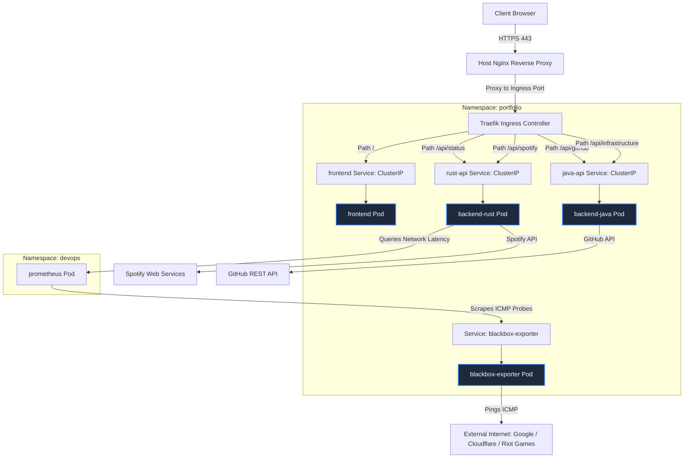
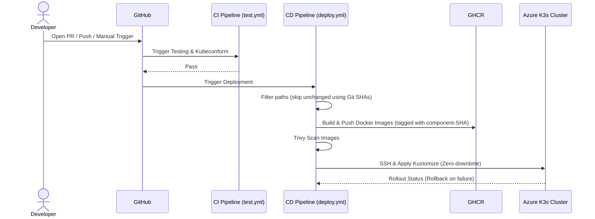

# Polyglot Portfolio Architecture 🚀

A high-performance, microservice-backed personal portfolio demonstrating full-stack engineering, system-level telemetry, and automated CI/CD deployment.

**🌐 Live Production Site:** [https://mattdev0.tech](https://mattdev0.tech)


---

## 🏗️ System Architecture

This monorepo houses three distinct microservices operating behind an Ingress controller (Traefik), orchestrated via Kubernetes (K3s) and automatically deployed via GitHub Actions.



### 1. Frontend Gateway (React / Vite)
A responsive, dark-themed UI built with Tailwind CSS. It dynamically polls the backend services for real-time telemetry and GitHub activity.

### 2. Java Engine (Spring Boot 4.0.6 / Java 21)
Handles external third-party API integration.
* **Bucket4j Rate Limiting:** Enforces client IP rate limiting on API paths (`/api/**`) at 60 req/min, with automatic reverse proxy header resolution (`X-Forwarded-For`) and actuator endpoints (`/actuator/**`) exemption.
* **Resilient API Clients:** Gracefully falls back to unauthenticated requests if GitHub credentials are not present or expire.
* **DTO Serialization:** Fully typed `InfrastructureMetrics` DTO replacement to prevent serialization issues.
* **Robust Test Isolation:** Prevents `TaskScheduler` execution overlap and database locks in integration tests using a custom `NoOpTaskSchedulerConfig`.
* Tomcat runtime version overridden to `11.0.22` to patch critical CVEs.

### 3. Rust Engine (Axum/Tokio)
Provides low-level system telemetry and external connectivity metrics.
* **Axum Nested Routing & tower-governor Rate Limiting:** Enforces client IP rate limiting on API paths (`/api/*`) at 60 req/min with `SmartIpKeyExtractor` (bypassing reverse proxy grouping), while leaving the Kubernetes `/healthz` endpoint completely exempt to avoid CrashLoopBackOff loops.
* **Graceful Shutdowns:** Monitors Unix termination signals and cancels background telemetry tasks using a `CancellationToken`.
* Real-time network telemetry (ICMP ping latency, availability) queried from Prometheus.
* CPU, memory, and thread utilization metrics.
* Live Spotify playback status with robust authentication fallback handling.
* Near-zero overhead performance.

---

## 📂 Project Structure

```text
portfolio-monorepo/
├── .github/
│   └── workflows/
│       ├── deploy.yml              # Production CD with Kustomize, Trivy, & Rollback automation
│       └── test.yml                # PR CI Validation Gate (tests, kubeconform, linting)
│
├── infrastructure/k8s/             # Kubernetes Manifests ☸️
│   ├── kustomization.yaml          # Declarative Kustomize Base
│   ├── ingress.yaml                # Traefik routing paths
│   ├── network-policies.yaml       # Namespace network isolation policies
│   ├── pdb.yaml                    # Pod Disruption Budget
│   ├── frontend.yaml
│   ├── java-api.yaml
│   └── rust-api.yaml
│
├── frontend-react/                 # React UI ⚛️
│   ├── src/__tests__/              # Vitest + React Testing Library Suite
│   └── src/
│
├── backend-java/                   # Spring Boot API ☕
│   ├── src/test/                   # JUnit + MockMvc Integration Tests
│   └── src/main/
│
├── backend-rust/                   # Rust Axum API 🦀
│   ├── src/                        # Tokio Async Handlers & Services
│   └── Cargo.toml
│
└── README.md
```

---

## 🧪 Testing

The repository maintains rigorous automated testing standards across all microservices.

* **Frontend (React):** Uses `Vitest` and `@testing-library/react`. Tests cover UI component rendering, asynchronous API fetching, and complex polling intervals utilizing mocked native timers (`vi.useFakeTimers()`).
* **Backend (Java):** Uses `JUnit 5`, `MockMvc`, and `MockRestServiceServer`. Ensures reliable integration with external REST APIs and correct JSON payload serialization.
* **Backend (Rust):** Unit tests powered by `cargo test` and `mockall`. Validates robust error handling, concurrency states, and mock Prometheus responses.

---

## 🔒 Security

All microservices adhere to strict DevSecOps patterns and Kubernetes security best practices:
* **NetworkPolicies Isolation:** Restricts incoming traffic per service using namespace rules (e.g. only allowing ingress from the Traefik Ingress controller in `kube-system`, or Prometheus in `devops` to scrape metrics). Egress is unrestricted for external API communications.
* **Application Rate Limiting:** Rate limiting on API routes is managed on both backends at 60 requests/minute/IP, utilizing custom request header extractors to prevent proxy IP spoofing. Critical infrastructure/liveness endpoints are structural bypasses.
* **Trivy Vulnerability Scanning:** Every built Docker container is scanned for OS/library vulnerabilities before deployment. `CRITICAL` vulnerabilities will automatically block deployments.
* **Kubernetes Hardening:** All pods enforce strict `securityContext` boundaries:
  * `readOnlyRootFilesystem: true`
  * `allowPrivilegeEscalation: false`
  * `runAsNonRoot: true` (executing as `nobody` user 65534).
  * `capabilities: drop: ["ALL"]`

---

## ☸️ Kubernetes & Reliability

Infrastructure manifests prioritize high availability and automated healing:
* **Kustomize Declarative Manifests:** Ensures atomic, deterministic cluster configurations.
* **Health Probes:** Comprehensive `livenessProbe`, `readinessProbe`, and `startupProbe` checks implemented across all APIs to verify endpoints (e.g., `/healthz` and `/actuator/health`) before accepting traffic.
* **Pod Disruption Budgets (PDB):** Enforces a `minAvailable: 1` requirement during evictions or node drains to maintain zero downtime.
* **kubeconform Validation:** CI pipelines strictly validate all K8s manifests against official Kubernetes schemas prior to deployment.

---

## 📊 Observability & Logging

Production monitoring is embedded deeply into the application stack:
* **Structured JSON Logging:** 
  * Rust utilizes `tracing` and `tracing-subscriber` for hierarchical, machine-readable JSON logs.
  * Java utilizes `Logback` with `logstash-logback-encoder` to format stdout outputs identically.
* **Prometheus Telemetry:** `blackbox-exporter` monitors external endpoint health and network latency.

---

## 🚀 CI/CD Modernization

This project utilizes an advanced, Trunk-Based CI/CD workflow executed via GitHub Actions.



### Deployment Flow Features
* **Conditional Builds (`dorny/paths-filter`):** The pipeline intelligently skips building/pushing Docker images if the respective microservice source code has not changed, utilizing component-specific Git SHAs.
* **Manual Trigger:** Supported via `workflow_dispatch` for troubleshooting and forced redeployments.
* **Zero-Downtime Rollouts:** Services update dynamically via Kustomize image patching.
* **Automated Rollbacks:** If a Kubernetes rollout stalls for more than 300 seconds, the pipeline automatically triggers a `kubectl rollout undo` to recover the previous stable state.

---

## 🛠️ Local Development Setup

### Prerequisites
* Node.js (v18+)
* Java 21+ & Maven
* Rust & Cargo
* Docker & Docker Compose

### Local Runtime Flag
The React frontend automatically detects local runtime when served by Vite or accessed via `localhost`. API calls intelligently map to local endpoints:
* Rust API: `http://localhost:8080`
* Java API: `http://localhost:8081`

To override local mode manually, copy `frontend-react/.env.example` to `frontend-react/.env.local`.

### 1. Start the Frontend
```bash
cd frontend-react
npm install
npm run dev
```

### 2. Start the Java Microservice
```bash
cd backend-java
./mvnw clean compile
./mvnw spring-boot:run
```

### 3. Start the Rust Engine
```bash
cd backend-rust
cargo run
```

---

## 🔌 API Gateway Endpoints

| Method | Route                         | Microservice | Description                                    |
| ------ | ----------------------------- | ------------ | ---------------------------------------------- |
| GET    | `/api/github/activity`        | Java         | Returns top 4 recent code pushes               |
| GET    | `/api/infrastructure/metrics` | Java         | Returns JVM memory allocation and thread count |
| GET    | `/api/status`                 | Rust         | Returns host OS telemetry (OS, CPU, Memory)    |
| GET    | `/api/status/network`         | Rust         | Returns live ICMP latency & status for pings   |
| GET    | `/api/status/network/history` | Rust         | Returns rolling 20-point network ping history  |
| GET    | `/api/spotify`                | Rust         | Returns current Spotify session with track URL |

---

## 📄 License
MIT
