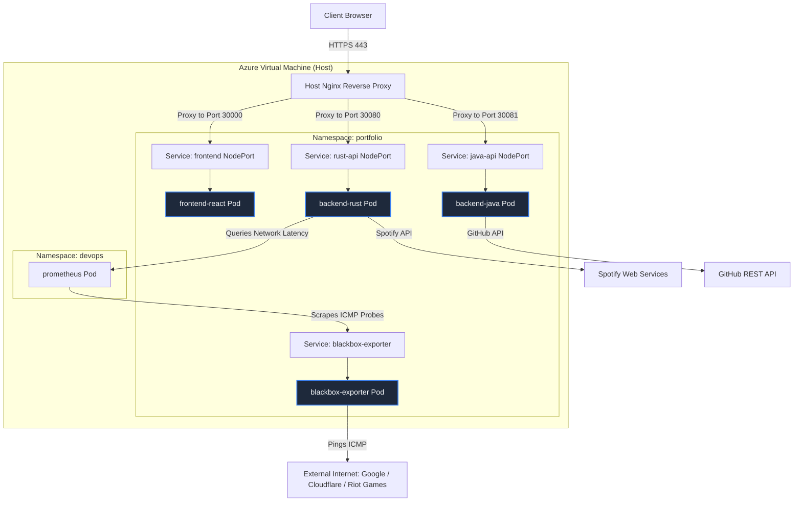
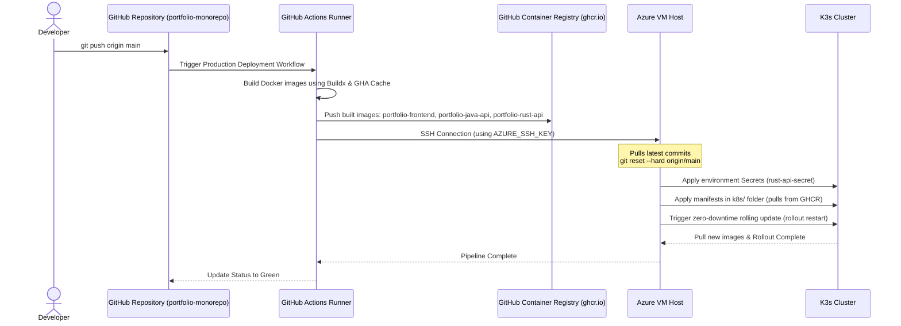

# Polyglot Portfolio Architecture 🚀

A high-performance, microservice-backed personal portfolio demonstrating full-stack engineering, system-level telemetry, and automated CI/CD deployment.

**🌐 Live Production Site:** [https://mattdev0.tech](https://mattdev0.tech)


---

# 🏗️ System Architecture

This monorepo houses three distinct microservices operating behind an Nginx reverse proxy, orchestrated via Kubernetes (K3s) and automatically deployed via GitHub Actions.



## 1. Frontend Gateway (React / Vite)

A responsive, dark-themed UI built with Tailwind CSS.
It dynamically polls the backend services for real-time telemetry and GitHub activity.

## 2. Java Engine (Spring Boot)

Handles external third-party API integration.

Features include:

* Resilient memory-cached JSON parsing
* Live GitHub commit history retrieval
* Graceful API rate-limit handling
* Safe parsing for missing metadata

## 3. Rust Engine (Axum/Tokio)

Provides low-level system telemetry and external connectivity metrics.

Features include:

* Real-time network telemetry (ICMP ping latency, availability) queried from Prometheus
* Fallback mock network telemetry generator for local developer mode
* CPU usage metrics
* Memory monitoring
* Thread monitoring
* Live Spotify playback status
* Near-zero overhead performance

## 4. Infrastructure Layer

Hosted on an Azure Virtual Machine.

Infrastructure stack includes:

* Kubernetes (K3s) cluster orchestration (namespace `portfolio`)
* Host Nginx reverse proxy routing to K3s NodePorts
* Isolated microservice pods with strict resource limits
* Automated CI/CD deployment pipeline deploying to K8s

---

# 📂 Project Structure

```text
portfolio-monorepo/
├── .github/
│   └── workflows/
│       └── deploy.yml
│
├── k8s/                        # Kubernetes Manifests ☸️
│   ├── namespace.yaml
│   ├── frontend.yaml
│   ├── java-api.yaml
│   ├── rust-api.yaml
│   └── blackbox-exporter.yaml  # [NEW] ICMP Probe Exporter
│
├── frontend-react/
│   ├── public/
│   │   └── favicon.png
│   ├── src/
│   │   ├── App.jsx
│   │   ├── GitHubActivity.jsx
│   │   ├── config.json
│   │   ├── main.jsx
│   │   └── index.css
│   ├── package.json
│   ├── vite.config.js
│   └── Dockerfile
│
├── backend-java/
│   ├── src/main/java/com/example/demo/
│   │   ├── DemoApplication.java
│   │   ├── InfrastructureController.java
│   │   ├── GitHubController.java
│   │   └── GitHubService.java
│   ├── pom.xml
│   └── Dockerfile
│
├── backend-rust/
│   ├── src/
│   │   └── main.rs
│   ├── Cargo.toml
│   └── Dockerfile
│
├── docker-compose.yml
└── README.md
```

---

# ⚙️ Core Engineering Features

## Resilient Data Fetching

The Java backend utilizes:

* Spring Cache (`@Cacheable`)
* Custom Jackson JSON tree mapping

This helps bypass GitHub API strict rate limits while safely parsing unpredictable payloads without throwing Null Pointer Exceptions.

## Live Hardware Telemetry

The Rust backend securely queries the host machine to serve live hardware utilization metrics to the frontend UI.

## CORS & Proxy Routing

Nginx handles domain routing:

* `/api/github`
* `/api/status`

This removes CORS complexities in production.

Local development uses:

* Vite proxy configuration
* Spring Boot `@CrossOrigin`

## Automated CI/CD

Fully automated GitHub Actions pipeline.

Pushes to the deployment branch automatically:

* Connect to Azure via SSH
* Pull latest repository changes
* Rebuild Docker containers
* Restart services with minimal downtime

---

# 🛠️ Local Development Setup

## Prerequisites

* Node.js (v18+)
* Java 17+ & Maven
* Rust & Cargo
* Docker & Docker Compose (optional locally, required for production)

---

## Local Runtime Flag

The React frontend now detects local runtime automatically when it is served by Vite dev mode or opened from `localhost`, `127.0.0.1`, `::1`, or `0.0.0.0`.

When local mode is active, frontend API calls use:

* Rust API: `http://localhost:8080`
* Java API: `http://localhost:8081`

To force or customize local mode, copy `frontend-react/.env.example` to `frontend-react/.env.local` and adjust the values:

```bash
VITE_LOCAL_DEV=true
VITE_LOCAL_RUST_API_BASE_URL=http://localhost:8080
VITE_LOCAL_JAVA_API_BASE_URL=http://localhost:8081
VITE_PRODUCTION_API_BASE_URL=https://mattdev0.tech
```

For the Rust service, `cargo run` is treated as local automatically. If you run a release build locally without Spotify credentials, set:

```bash
APP_ENV=local
```

For local Docker, use the local Compose override:

```bash
docker compose -f docker-compose.yml -f docker-compose.local.yml up --build
```

Then open:

```text
http://localhost:3000
```

The main `docker-compose.yml` keeps `APP_ENV=production` by default for Azure deployments.

---

## 1. Start the Frontend

```bash
cd frontend-react
npm install
npm run dev
```

Runs locally on:

```text
http://localhost:5173
```

---

## 2. Start the Java Microservice

```bash
cd backend-java
./mvnw clean compile
./mvnw spring-boot:run
```

Runs locally on:

```text
http://localhost:8081
```

---

## 3. Start the Rust Engine

```bash
cd backend-rust
cargo run
```

Runs locally on:

```text
http://localhost:8080
```

---

# 🚀 Production Deployment

This project utilizes a Trunk-Based CI/CD deployment workflow deploying directly to Kubernetes.



## Required GitHub Secrets

Configure the following repository secrets in GitHub:

* `AZURE_HOST`
* `AZURE_USER`
* `AZURE_SSH_KEY`

### Optional Configurations
* `GITHUB_TOKEN`: Add this to `backend-rust/.env` on the host to authenticate requests to GitHub APIs, elevating your rate limits from 60 to 5,000 requests/hr.

## Deployment Flow

Push code to the deployment branch (`main`).

GitHub Actions will automatically:

1. Build the Docker images on the GitHub Actions runner using Docker Buildx and GHA caching.
2. Push the built images to GitHub Container Registry (GHCR) at `ghcr.io/mattdev0/portfolio-monorepo/...`.
3. Connect to the Azure VM via SSH.
4. Pull the latest code changes (specifically updating the Kubernetes manifests).
5. Dynamically configure K8s environment Secrets from the `.env` file on the VM.
6. Apply the Kubernetes manifests in the `k8s/` folder, instructing K3s to pull the pre-built images from GHCR.
7. Trigger a zero-downtime rolling update:
   ```bash
   sudo kubectl rollout restart deployment/frontend deployment/java-api deployment/rust-api -n portfolio
   ```

---

# 🔌 API Gateway Endpoints

| Method | Route                         | Microservice | Description                                    |
| ------ | ----------------------------- | ------------ | ---------------------------------------------- |
| GET    | `/api/github/activity`        | Java         | Returns top 4 recent code pushes               |
| GET    | `/api/infrastructure/metrics` | Java         | Returns JVM memory allocation and thread count |
| GET    | `/api/status`                 | Rust         | Returns host OS telemetry (OS, CPU, Memory)    |
| GET    | `/api/status/network`         | Rust         | Returns live ICMP latency & status for pings   |
| GET    | `/api/status/network/history` | Rust         | Returns rolling 20-point network ping history  |
| GET    | `/api/spotify`                | Rust         | Returns current Spotify session with track URL |

---

# 📦 Tech Stack

## Frontend

* React
* Vite
* Tailwind CSS

## Backend

* Java Spring Boot
* Rust (Axum/Tokio)

## Infrastructure

* Docker
* Docker Compose
* Nginx
* Azure VM
* Kubernetes (K3s)
* Prometheus Blackbox Exporter
* GitHub Actions

---

# 📄 License

MIT
